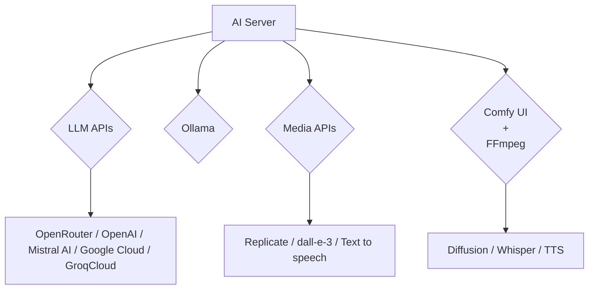

# ai-server

Self-hosted private gateway to manage access to multiple LLM APIs, Ollama endpoints, 
Media APIs, Comfy UI and FFmpeg Agents 

## Self Hosted AI Server API Gateway

AI Server is a way to orchestrate your AI requests through a single self-hosted private gateway to control what AI Providers your Apps with only a single typed client integration. It can be used to process LLM, AI, Diffusion and image transformation requests which are dynamically delegated across multiple configured providers which
can include any Ollama endpoint, OpenRouter / OpenAI / Mistral AI / Google Cloud / GroqCloud LLM APIs, 
Replicate / Open AI/Dall-e-3 / Text to speech Media APIs, Diffusion / Whisper / Text to Speech from Comfy UI and FFmpeg Agents.

### Comfy UI FFmpeg Agents

As part of the overall AI Server solution we're also maintaining [Docker Client Agents](https://docs.servicestack.net/ai-server/comfy-extension) configured with Comfy UI, Whisper and FFmpeg which can be installed on GPU Servers to provide a full stack media processing pipeline for video and audio files which can be used as part of your AI workflows.

See [AI Server Docs](https://docs.servicestack.net/ai-server/) for documentation on 
[installation](https://docs.servicestack.net/ai-server/quickstart) and 
[configuration](https://docs.servicestack.net/ai-server/configuration).

## Built In UIs

In addition to its backend APIs, it also includes several built in UI's for utlizing AI Server features:

### Open AI Chat

### Text to Image

### Image to Text

### Image to Image

### Speech to Text

### Text to Speech

## Admin UIs

AI and Media Providers can be managed via the built in admin UIs:

