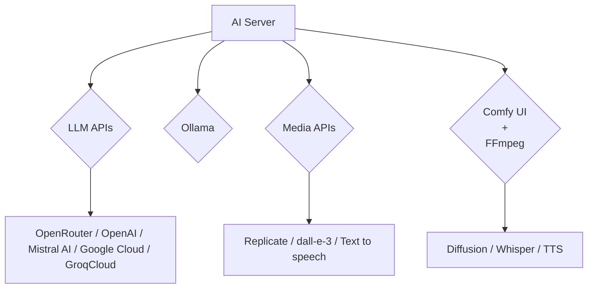

# ai-server

Website: [openai.servicestack.net](https://openai.servicestack.net).

## News

 - [May 2025 Update](https://servicestack.net/posts/ai-server-2025-05)

Self-hosted private gateway to manage access to multiple LLM APIs, Ollama endpoints, Media APIs, Comfy UI and FFmpeg Agents.

## Self Hosted AI Server API Gateway

AI Server is a way to orchestrate your AI requests through a single self-hosted private gateway to control what AI Providers your Apps with only a single typed client integration. It can be used to process LLM, AI, Diffusion and image transformation requests which are dynamically delegated across multiple configured providers which can include any 
Ollama endpoint, OpenRouter / OpenAI / Mistral AI / Google Cloud / GroqCloud LLM APIs, Replicate / Open AI/Dall-e-3 / 
Text to speech Media APIs, Diffusion / Whisper / Text to Speech from Comfy UI and FFmpeg Agents.

### Comfy UI FFmpeg Agents

As part of the overall AI Server solution we're also maintaining [Docker Client Agents](https://docs.servicestack.net/ai-server/comfy-extension) configured with Comfy UI, Whisper and FFmpeg which can be installed on GPU Servers to provide a full stack media processing pipeline for video and audio files which can be used as part of your AI workflows.

See [AI Server Docs](https://docs.servicestack.net/ai-server/) for documentation on 
[installation](https://docs.servicestack.net/ai-server/quickstart) and 
[configuration](https://docs.servicestack.net/ai-server/configuration).

## Built In UIs

In addition to its backend APIs, it also includes several built in UI's for utlizing AI Server features:

### Open AI Chat

### Text to Image

### Image to Text

### Image to Image

### Speech to Text

### Text to Speech

## Admin UIs

Use Admin UIs to manage AI and Media Providers and API Key Access

Increase capacity by adding AI Providers that can process LLM Requests

Add local Ollama endpoints and control which of their Models can be used

Glossary of LLM models available via Ollama or LLM APIs

List of different AI Provider Types that AI Server supports

Increase capacity by adding AI Providers that can process Media & FFmpeg Requests

Add a new Replicate API Media Provider and which diffusion models to enable

Add a new Comfy UI Agent and control which of its models can be used

Glossary of different Media Provider Types that AI Server supports

View built-in and interactive API Analytics

View completed and failed Background Jobs from Jobs Dashboard

Monitor Live progress of executing AI Requests

View all currently pending and executing AI Requests

Use Admin UI to manage API Keys that can access AI Server APIs and Features

Edit API Keys for fine grain control over API Keys access and scope

View detailed API Request logging

